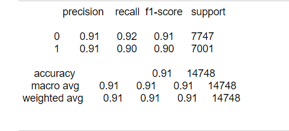

# About this repository

 This is a web app for detecting fake news. It is build using <b>Flask</b>, and <b>Scikit</b> library.
It uses machine learning model for making prediction trained on dataset from kaggle. 

# Machine Learning model used

<b>Gaussian Naive Bayes</b> is used for training and making prediction. Gaussian NB is one of modified version of conventional Naive bayes model.
The conventional model work on Bayes theorem but Gaussian NB make some more statistical calculation for precise prediction.  
Instead of relying on bayes theorem that is calulated using conditional probability Gaussian NB does more work by calculating mean and 
standard deviation. Probabilities is calculated using Gaussian probability that comprises of data, mean, SD(standard deviation). I choose Gaussian naive bayes model for this 
task because there is no parameter to be learned like in linear regression thus it is fast. 

### Model performance 
Dataset was taken from kaggle and can be found in this repo itself. It contains 45000 data samples including both categories(Fake and Legit). 
Many preprocessing techniques were used like: 
<ul>
<li>StopWords removed</li>
<li>Stemming </li>
<li>HTML tag removed</li>
<li>Special characters removed</li>
</ul>

After training model performed well with 91% accuracy.  

  

# Libraries used
<ul>
<li>NLTK</li>
<li>Sklearn</li>
<li>Numpy</li>
<li>Pandas</li>
<li>Pickle</li>
</ul>

#### To know more about how does Gaussian Naive Bayes work refer this article
https://machinelearningmastery.com/naive-bayes-for-machine-learning/#:~:text=Gaussian%20Naive%20Bayes&text=Other%20functions%20can%20be%20used,deviation%20from%20your%20training%20data.
